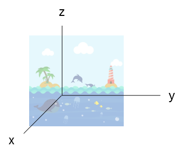

# Viagem ao fundo do mar

Uma equipe de cientista está explorando a Fossa das Marianas e para isso utiliza submarinos não tripulados.

> A Fossa das Marianas é o local mais profundo dos oceanos, atingindo uma profundidade de 11 034 metros.
> Localiza-se no oceano Pacífico, a leste das ilhas Marianas, na fronteira convergente entre as placas tectônicas do
> Pacífico e das Filipinas. (Wikipédia)

Os cientistas já mapearam a área a ser explorada e a dividiram em três eixos: X, Y e Z.

Esses eixos controlam o posicionamento e profundidade do submarino.



A posição do submarino é representado pela notação (0, 0, 0, NORTE) que indica os pontos X, Y, Z e
a direção que o submarino aponta (Norte, Sul, Leste e Oeste).

Os cientistas utilizam uma serie de comandos simples para fazer a movimentação do submarino:

+ L e R para girar o submarino para esquerda ou direita,
+ M para mover o submarino e
+ U e D para subir ou descer o submarino.

Você deve desenvolver um sistema que processe uma série de comandos e faça a navegação desse submarino.

Para simplificar, leve em consideração que o submarino sempre começará no ponto (0, 0, 0, NORTE) e

que todo movimento quando o submarino estiver apontando para o NORTE, somará 1 ao eixo Y,

todo movimento quando o submarino estiver apontando para o LESTE somará 1 ao eixo X e

todo movimento para baixo diminuirá 1 do eixo Z.

Ah, vale lembrar que 0 no eixo Z é a superfície do oceano


## Entrada:

Os cientistas mandarão os comandos agrupados em uma única linha, como no exemplo:

```
LMRDDMMUU
```


## Saída:

A saída deverá conter a coordenada final do submarino junto com sua direção, como no exemplo:

```
-1 2 0 NORTE
```


## Exemplo de execução:


Dado a seguinte entrada:

```
RMMLMMMDDLL
```

A saída esperada é:

```
2 3 -2 SUL
```

Lembrando que a posição inicial do submarino é 0, 0, 0, NORTE